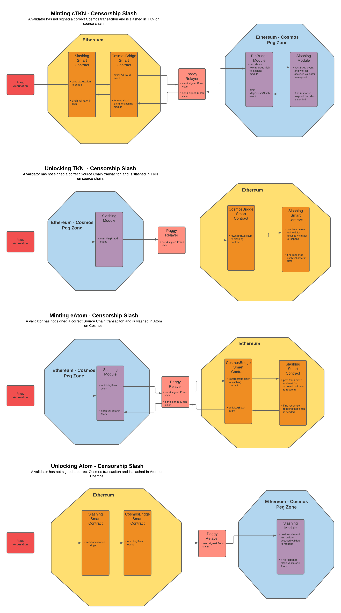
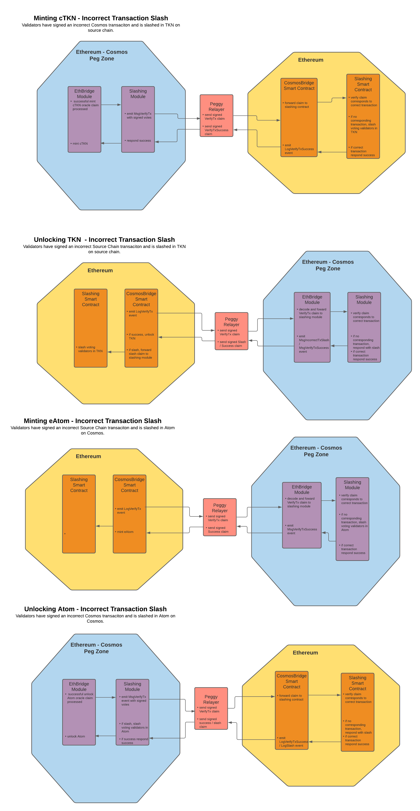

# **Pegged Token Model Extensions Architecture**

## Changelog
-First Draft: Austin Haines 11/04/2020

## Context

Peggy facilitates cross-chain value transfer between a source chain and Cosmos. Security for Peggy's intra-chain transactions are guaranteed by each chain's underlying consensus mechanisms. In order to secure Peggy's inter-chain transactions and decentralize control of Peggy we must add the following functionality: 

- Cross-Chain Slashing
- Validator Incentives
- Exchange Rates
- Price Oracles

In order to acheive this we will wrap the following Cosmos modules:

- staking
- slashing
- distribution
- gov

We will implement the following custom Cosmos modules: 

- XChainSlashing
- Pricefeed
- Auction

And we will mirror these modules with the following smart contracts:

- Staking
- Incentive
- Slashing
- Auction


The architecture of each new system, alterations to existing systems, and the logical flow of operations are described below.

## Peg Zone Cosmos Module Additions

Cosmos provides the following modules that we will wrap in order to customize their parameters at genesis.

**Staking:** The Cosmos staking module handles validator staking.

**Slashing:** The Cosmos slashing module provides us with standard Tendermint intra-chain slashing. We also use the module to slash when we determine that a cross-chain infraction has taken place. The module also provides methods for querying slashing states such as jailing that can be pushed through the Relayer and mirrored on the source chain.

**Gov:** The Cosmos governance module allows users to submit and vote on `Proposal`s. We use this system in combination with new `Parameter`s throughout Peggy to facilitate decentralized control of Peggy's behaviors. `Parameter`s are values that can be changed through governance via `Proposal`s. Systems such as the Service Rate for validator incentives have a corresponding `Parameter` that can be changed through governance in this manner.

**Distribution:** The Cosmos distribution module is responsible for distributing fee rewards to validators and their delegators.

## Peg Zone Custom Modules

**XChainSlashing:** Our custom cross chain slashing module implementation allows for the processing of cross-chain slashing accusations and infractions. For incorrect transaction slashes the module verifies that cross-chain transactions have corresponding transactions on the source chain. For censorship slashes the module receives fraud accusation messages, emits an event to notify the accused validator, and processes the results. When it is determined that an infraction has occurred the module utilizes Cosmos's slashing module to slash the validator at fault.

**XChainSlashing Params:**
```golang
// Params params for pricefeed. Can be altered via governance
type Params struct {
    SlashFractionCensor sdk.Dec        // Fraction of Atom to be slashed for censorship infractions
    SlashFractionIncorrectTx sdk.Dec   // Fraction of Atom to be slashed for incorrect transaction infractions
    GracePeriod sdk.uint               // Grace period allotted for validator response to accusation
}
```

**XChainSlashing Messages:**
```golang
// MsgHandleFraudAccusation struct representing a posted fraud accusation message. Censorship slashing
type MsgPostFraudAccusation struct {
	FraudAccuser     sdk.AccAddress
	AccusedVal sdk.AccAddress
	TxHash    string      
}

// MsgHandleFraudAccusation struct representing a posted signed validator vote. Censorship slashing
type MsgPostSignedVote struct {
    AccusedVal sdk.AccAddress
    TxHash   string
	Claim    Claim      
}

// MsgVerifyTx struct representing a request to verify a cross-chain transaction. Incorrect Transaction slashing
type MsgVerifyTx struct {
    SignedVotes  Prophecy
}

```

**XChainSlashing Events:**
```golang
//EventTypePostFraud event representing a posted accusation of fraud 
EventTypePostFraud = "post_fraud"
sdk.NewEvent(
			types.EventTypePostFraud,
			sdk.NewAttribute(types.AttributeKeyFraudAccuser, msg.FraudAccuser.String()),
			sdk.NewAttribute(types.AttributeKeyAccusedVal, msg.AccusedVal.String()),
			sdk.NewAttribute(types.AttributeKeyTxHash, msg.TxHash),
        )
        
//EventTypeMsgFraud event representing afraud accusation to be sent over the relayer 
EventTypeMsgFraud = "fraud"
sdk.NewEvent(
			types.EventTypePostFraud,
			sdk.NewAttribute(types.AttributeKeyFraudAccuser, msg.FraudAccuser.String()),
			sdk.NewAttribute(types.AttributeKeyAccusedVal, msg.AccusedVal.String()),
			sdk.NewAttribute(types.AttributeKeyTxHash, msg.TxHash),
        )

//EventTypeMsgFraud event representing afraud accusation to be sent over the relayer 
EventTypeMsgVerifyTx = "verify_tx"
sdk.NewEvent(
			types.EventTypeMsgVerifyTx,
			sdk.NewAttribute(types.AttributeKeyClaimValidators, msg.ClaimValidators
			sdk.NewAttribute(types.AttributeKeyValidatorClaims, msg.ValidatorClaims),
        )

//EventTypeMsgIncorrectTxSlash event representing an incorrect transaction slash to be sent over the relayer 
EventTypeMsgIncorrectTxSlash = "incorrect_tx_slash"
sdk.NewEvent(
			types.EventTypePostFraud,
			sdk.NewAttribute(types.AttributeKeyClaimValidators, msg.ClaimValidators
			sdk.NewAttribute(types.AttributeKeyValidatorClaims, msg.ValidatorClaims),
        )

//EventTypeMsgCensorSlash event representing a censorship slash to be sent over the relayer 
EventTypeMsgCensorSlash = "censor_slash"
sdk.NewEvent(
			types.EventTypePostFraud,
			sdk.NewAttribute(types.AttributeKeyAccusedVal, msg.AccusedVal.String()),
			sdk.NewAttribute(types.AttributeKeyTxHash, msg.TxHash),
        )

//EventTypeMsgVerifyTxSuccess event representing a successful transaction verification to be sent over the relayer 
EventTypeMsgVerifyTxSuccess = "verify_tx_success"
sdk.NewEvent(
			types.EventTypePostFraud,
			sdk.NewAttribute(types.AttributeKeyClaimValidators, msg.ClaimValidators
			sdk.NewAttribute(types.AttributeKeyValidatorClaims, msg.ValidatorClaims),
        )
```

**Pricefeed:** The pricefeed module is responsible for posting prices of various markets. Prices are posted by a group of oracles chosen by validators and changed through `Parameter` change governance `Proposal`s. This pricefeed is used to determine the Security Collateralization Rate which in turn alters the behavior of Peggy's bridges.

**Pricefeed Params:**
```golang
// Params params for pricefeed. Can be altered via governance
type Params struct {
	Markets Markets eed
}

// Market an asset in the pricefeed
type Market struct {
	MarketID   string  
	BaseAsset  string    
	QuoteAsset string
	Oracles    []sdk.AccAddress
	Active     bool
}

type Markets []Market

```

**Pricefeed Genesis State:**

```golang
// GenesisState - pricefeed state that must be provided at genesis
type GenesisState struct {
	Params       Params
	PostedPrices []PostedPrice
}

// PostedPrice price for market posted by a specific oracle
type PostedPrice struct {
	MarketID      string
	OracleAddress sdk.AccAddress
	Price         sdk.Dec
	Expiry        time.Time
}

type PostedPrices []PostedPrice

```

**Pricefeed Messages:**
```golang
// MsgPostPrice struct representing a posted price message.
// Used by oracles to input prices to the pricefeed
type MsgPostPrice struct {
	From     sdk.AccAddress
	MarketID string
	Price    sdk.Dec      
	Expiry   time.Time
}
```


**Auction:** The auction module is responsible for posting and processing auctions of locked assets in exchange for pegged assets. This module is used when the Security Collateralization rate dips below a threshold set by governance.

## EthBridge Module Changes

**Parameters:**

**Service Rate**
```golang
type Params struct {
    ServiceRate sdk.Dec   // Service rate fraction to be added to new deposits to the peg zone
}
```

**Security Collateralization Rate**
```golang
type Params struct {
    RelaxedRate sdk.Dec   // Security Collateralization Rate at which Relaxed actions are in effect
    AlertRate sdk.Dec     // Security Collateralization Rate at which Alert actions are in effect
    AuctionRate sdk.Dec   // Security Collateralization Rate at which Auction actions are in effect

}
```

**Transaction Verification:** In order to perform incorrect transaction slashing the EthBridge module will need to send a request for verification to the source chain before releasing funds once a prophecy has successfully completed. The module will use the XChainSlashing module's `MsgVerifyTx` to notify the relayer that verification is needed. Upon response from the source chain the module will either release the funds or slash the validators.

## Relayer Changes

In order to propogate Cosmos validator set and slashing changes such as jailing over to the source chain the relayer will need to listen for additional events. These events will be sent to the source chain where the valset will be updated as needed.
- EventTypeCompleteRedelegation
- EventTypeCompleteUnbonding
- EventTypeSlash
## Smart Contracts

**Staking:** The staking contract is responsible for facilitating staking on the source chain through a shared wallet of which all validators are signatories. The contract will change the shared wallet as necessary to reflect the state of the validator set on Cosmos. These changes will be sent from the Peg Zone over the relayer and forwarded to the staking contract from the bridge contract.

**Incentive:** The incentive contract is responsible for managing an incentive lockup group filled by the Service Rate paid by users when source asset deposits are made. The contract pays validators from this lockup group over time at a rate set by the network. 

**Auction:** 

## Cosmos-SDK Wrapped Modules

In order to leverage Cosmos-SDK pre-existing modules and customize their default parameters we will wrap each module. Wrapping the modules lets us control what functionality is exposed as well as set default parameters that dictate how each module functions and can later be changed through governance. The process is essentially copying the necessary files from cosmos-sdk and making alterations where desired.

Each wrapped module will have the following basic structure with alterations depending on what functionality we wish to customize:

    -x/
        -module/
            -types/
                -codec.go
            -alias.go
            -cosmos_alias.go
            -module.go

In each module's `module.go` file we will expose the module's `DefaultGenesis()` function where we can alter its default parameters. Once we have these wrapped modules we can import them in the peg zone's main `app.go` file instead of the base Cosmos modules. Example implementations of the above files for the staking module are as follows:

**codec.go**
```golang
package types

import (
	"github.com/cosmos/cosmos-sdk/codec"
	"github.com/cosmos/cosmos-sdk/x/staking"
)

// RegisterCodec registers concrete types on codec codec
func RegisterCodec(cdc *codec.Codec) {
	cdc.RegisterConcrete(staking.MsgCreateValidator{}, "staking/MsgCreateValidator", nil)
	cdc.RegisterConcrete(staking.MsgEditValidator{}, "staking/MsgEditValidator", nil)
	cdc.RegisterConcrete(staking.MsgDelegate{}, "staking/MsgDelegate", nil)
	cdc.RegisterConcrete(staking.MsgUndelegate{}, "staking/MsgUndelegate", nil)
	cdc.RegisterConcrete(staking.MsgBeginRedelegate{}, "staking/MsgBeginRedelegate", nil)
}

// ModuleCdc is generic sealed codec to be used throughout this module
var ModuleCdc *codec.Codec

func init() {
	ModuleCdc = codec.New()
	RegisterCodec(ModuleCdc)
	codec.RegisterCrypto(ModuleCdc)
	ModuleCdc.Seal()
}
```

**alias.go**
```golang
package staking

import (
	"github.com/sifchain/peggy/x/staking/types"
)

var (
	// functions aliases
	RegisterCodec = types.RegisterCodec

	// variable aliases
	ModuleCdc = types.ModuleCdc
)
```

**cosmos_alias.go**
```golang
package staking

import (
	"github.com/cosmos/cosmos-sdk/x/staking"
)

const (
	DefaultParamspace                  = staking.DefaultParamspace
	ModuleName                         = staking.ModuleName
	StoreKey                           = staking.StoreKey
	TStoreKey                          = staking.TStoreKey
	QuerierRoute                       = staking.QuerierRoute
	RouterKey                          = staking.RouterKey
	DefaultUnbondingTime               = staking.DefaultUnbondingTime
	DefaultMaxValidators               = staking.DefaultMaxValidators
	DefaultMaxEntries                  = staking.DefaultMaxEntries
	NotBondedPoolName                  = staking.NotBondedPoolName
	BondedPoolName                     = staking.BondedPoolName
	QueryValidators                    = staking.QueryValidators
	QueryValidator                     = staking.QueryValidator
	QueryDelegatorDelegations          = staking.QueryDelegatorDelegations
	QueryDelegatorUnbondingDelegations = staking.QueryDelegatorUnbondingDelegations
	QueryRedelegations                 = staking.QueryRedelegations
	QueryValidatorDelegations          = staking.QueryValidatorDelegations
	QueryValidatorRedelegations        = staking.QueryValidatorRedelegations
	QueryValidatorUnbondingDelegations = staking.QueryValidatorUnbondingDelegations
	QueryDelegation                    = staking.QueryDelegation
	QueryUnbondingDelegation           = staking.QueryUnbondingDelegation
	QueryDelegatorValidators           = staking.QueryDelegatorValidators
	QueryDelegatorValidator            = staking.QueryDelegatorValidator
	QueryPool                          = staking.QueryPool
	QueryParameters                    = staking.QueryParameters
	MaxMonikerLength                   = staking.MaxMonikerLength
	MaxIdentityLength                  = staking.MaxIdentityLength
	MaxWebsiteLength                   = staking.MaxWebsiteLength
	MaxDetailsLength                   = staking.MaxDetailsLength
	DoNotModifyDesc                    = staking.DoNotModifyDesc
)

var (
	// functions aliases
	RegisterInvariants                 = staking.RegisterInvariants
	AllInvariants                      = staking.AllInvariants
	ModuleAccountInvariants            = staking.ModuleAccountInvariants
	NonNegativePowerInvariant          = staking.NonNegativePowerInvariant
	PositiveDelegationInvariant        = staking.PositiveDelegationInvariant
	DelegatorSharesInvariant           = staking.DelegatorSharesInvariant
	NewKeeper                          = staking.NewKeeper
	ParamKeyTable                      = staking.ParamKeyTable
	NewQuerier                         = staking.NewQuerier
	NewCommissionRates                 = staking.NewCommissionRates
	NewCommission                      = staking.NewCommission
	NewCommissionWithTime              = staking.NewCommissionWithTime
	NewDelegation                      = staking.NewDelegation
	MustMarshalDelegation              = staking.MustMarshalDelegation
	MustUnmarshalDelegation            = staking.MustUnmarshalDelegation
	UnmarshalDelegation                = staking.UnmarshalDelegation
	NewUnbondingDelegation             = staking.NewUnbondingDelegation
	NewUnbondingDelegationEntry        = staking.NewUnbondingDelegationEntry
	MustMarshalUBD                     = staking.MustMarshalUBD
	MustUnmarshalUBD                   = staking.MustUnmarshalUBD
	UnmarshalUBD                       = staking.UnmarshalUBD
	NewRedelegation                    = staking.NewRedelegation
	NewRedelegationEntry               = staking.NewRedelegationEntry
	MustMarshalRED                     = staking.MustMarshalRED
	MustUnmarshalRED                   = staking.MustUnmarshalRED
	UnmarshalRED                       = staking.UnmarshalRED
	NewDelegationResp                  = staking.NewDelegationResp
	NewRedelegationResponse            = staking.NewRedelegationResponse
	NewRedelegationEntryResponse       = staking.NewRedelegationEntryResponse
	ErrEmptyValidatorAddr              = staking.ErrEmptyValidatorAddr
	ErrBadValidatorAddr                = staking.ErrBadValidatorAddr
	ErrNoValidatorFound                = staking.ErrNoValidatorFound
	ErrValidatorOwnerExists            = staking.ErrValidatorOwnerExists
	ErrValidatorPubKeyExists           = staking.ErrValidatorPubKeyExists
	ErrValidatorPubKeyTypeNotSupported = staking.ErrValidatorPubKeyTypeNotSupported
	ErrValidatorJailed                 = staking.ErrValidatorJailed
	ErrBadRemoveValidator              = staking.ErrBadRemoveValidator
	ErrCommissionNegative              = staking.ErrCommissionNegative
	ErrCommissionHuge                  = staking.ErrCommissionHuge
	ErrCommissionGTMaxRate             = staking.ErrCommissionGTMaxRate
	ErrCommissionUpdateTime            = staking.ErrCommissionUpdateTime
	ErrCommissionChangeRateNegative    = staking.ErrCommissionChangeRateNegative
	ErrCommissionChangeRateGTMaxRate   = staking.ErrCommissionChangeRateGTMaxRate
	ErrCommissionGTMaxChangeRate       = staking.ErrCommissionGTMaxChangeRate
	ErrSelfDelegationBelowMinimum      = staking.ErrSelfDelegationBelowMinimum
	ErrMinSelfDelegationInvalid        = staking.ErrMinSelfDelegationInvalid
	ErrMinSelfDelegationDecreased      = staking.ErrMinSelfDelegationDecreased
	ErrEmptyDelegatorAddr              = staking.ErrEmptyDelegatorAddr
	ErrBadDenom                        = staking.ErrBadDenom
	ErrBadDelegationAddr               = staking.ErrBadDelegationAddr
	ErrBadDelegationAmount             = staking.ErrBadDelegationAmount
	ErrNoDelegation                    = staking.ErrNoDelegation
	ErrBadDelegatorAddr                = staking.ErrBadDelegatorAddr
	ErrNoDelegatorForAddress           = staking.ErrNoDelegatorForAddress
	ErrInsufficientShares              = staking.ErrInsufficientShares
	ErrDelegationValidatorEmpty        = staking.ErrDelegationValidatorEmpty
	ErrNotEnoughDelegationShares       = staking.ErrNotEnoughDelegationShares
	ErrBadSharesAmount                 = staking.ErrBadSharesAmount
	ErrBadSharesPercent                = staking.ErrBadSharesPercent
	ErrNotMature                       = staking.ErrNotMature
	ErrNoUnbondingDelegation           = staking.ErrNoUnbondingDelegation
	ErrMaxUnbondingDelegationEntries   = staking.ErrMaxUnbondingDelegationEntries
	ErrBadRedelegationAddr             = staking.ErrBadRedelegationAddr
	ErrNoRedelegation                  = staking.ErrNoRedelegation
	ErrSelfRedelegation                = staking.ErrSelfRedelegation
	ErrTinyRedelegationAmount          = staking.ErrTinyRedelegationAmount
	ErrBadRedelegationDst              = staking.ErrBadRedelegationDst
	ErrTransitiveRedelegation          = staking.ErrTransitiveRedelegation
	ErrMaxRedelegationEntries          = staking.ErrMaxRedelegationEntries
	ErrDelegatorShareExRateInvalid     = staking.ErrDelegatorShareExRateInvalid
	ErrBothShareMsgsGiven              = staking.ErrBothShareMsgsGiven
	ErrNeitherShareMsgsGiven           = staking.ErrNeitherShareMsgsGiven
	ErrInvalidHistoricalInfo           = staking.ErrInvalidHistoricalInfo
	ErrNoHistoricalInfo                = staking.ErrNoHistoricalInfo
	NewGenesisState                    = staking.NewGenesisState
	DefaultGenesisState                = staking.DefaultGenesisState
	NewMultiStakingHooks               = staking.NewMultiStakingHooks
	GetValidatorKey                    = staking.GetValidatorKey
	GetValidatorByConsAddrKey          = staking.GetValidatorByConsAddrKey
	AddressFromLastValidatorPowerKey   = staking.AddressFromLastValidatorPowerKey
	GetValidatorsByPowerIndexKey       = staking.GetValidatorsByPowerIndexKey
	GetLastValidatorPowerKey           = staking.GetLastValidatorPowerKey
	ParseValidatorPowerRankKey         = staking.ParseValidatorPowerRankKey
	GetValidatorQueueTimeKey           = staking.GetValidatorQueueTimeKey
	GetDelegationKey                   = staking.GetDelegationKey
	GetDelegationsKey                  = staking.GetDelegationsKey
	GetUBDKey                          = staking.GetUBDKey
	GetUBDByValIndexKey                = staking.GetUBDByValIndexKey
	GetUBDKeyFromValIndexKey           = staking.GetUBDKeyFromValIndexKey
	GetUBDsKey                         = staking.GetUBDsKey
	GetUBDsByValIndexKey               = staking.GetUBDsByValIndexKey
	GetUnbondingDelegationTimeKey      = staking.GetUnbondingDelegationTimeKey
	GetREDKey                          = staking.GetREDKey
	GetREDByValSrcIndexKey             = staking.GetREDByValSrcIndexKey
	GetREDByValDstIndexKey             = staking.GetREDByValDstIndexKey
	GetREDKeyFromValSrcIndexKey        = staking.GetREDKeyFromValSrcIndexKey
	GetREDKeyFromValDstIndexKey        = staking.GetREDKeyFromValDstIndexKey
	GetRedelegationTimeKey             = staking.GetRedelegationTimeKey
	GetREDsKey                         = staking.GetREDsKey
	GetREDsFromValSrcIndexKey          = staking.GetREDsFromValSrcIndexKey
	GetREDsToValDstIndexKey            = staking.GetREDsToValDstIndexKey
	GetREDsByDelToValDstIndexKey       = staking.GetREDsByDelToValDstIndexKey
	NewMsgCreateValidator              = staking.NewMsgCreateValidator
	NewMsgEditValidator                = staking.NewMsgEditValidator
	NewMsgDelegate                     = staking.NewMsgDelegate
	NewMsgBeginRedelegate              = staking.NewMsgBeginRedelegate
	NewMsgUndelegate                   = staking.NewMsgUndelegate
	NewParams                          = staking.NewParams
	DefaultParams                      = staking.DefaultParams
	MustUnmarshalParams                = staking.MustUnmarshalParams
	UnmarshalParams                    = staking.UnmarshalParams
	NewPool                            = staking.NewPool
	NewQueryDelegatorParams            = staking.NewQueryDelegatorParams
	NewQueryValidatorParams            = staking.NewQueryValidatorParams
	NewQueryBondsParams                = staking.NewQueryBondsParams
	NewQueryRedelegationParams         = staking.NewQueryRedelegationParams
	NewQueryValidatorsParams           = staking.NewQueryValidatorsParams
	NewQueryHistoricalInfoParams       = staking.NewQueryHistoricalInfoParams
	NewValidator                       = staking.NewValidator
	MustMarshalValidator               = staking.MustMarshalValidator
	MustUnmarshalValidator             = staking.MustUnmarshalValidator
	UnmarshalValidator                 = staking.UnmarshalValidator
	NewDescription                     = staking.NewDescription
	WriteValidators                    = staking.WriteValidators
	NewCosmosAppModule                 = staking.NewAppModule

	// variable aliases
	CosmosModuleCdc                  = staking.ModuleCdc
	LastValidatorPowerKey            = staking.LastValidatorPowerKey
	LastTotalPowerKey                = staking.LastTotalPowerKey
	ValidatorsKey                    = staking.ValidatorsKey
	ValidatorsByConsAddrKey          = staking.ValidatorsByConsAddrKey
	ValidatorsByPowerIndexKey        = staking.ValidatorsByPowerIndexKey
	DelegationKey                    = staking.DelegationKey
	UnbondingDelegationKey           = staking.UnbondingDelegationKey
	UnbondingDelegationByValIndexKey = staking.UnbondingDelegationByValIndexKey
	RedelegationKey                  = staking.RedelegationKey
	RedelegationByValSrcIndexKey     = staking.RedelegationByValSrcIndexKey
	RedelegationByValDstIndexKey     = staking.RedelegationByValDstIndexKey
	UnbondingQueueKey                = staking.UnbondingQueueKey
	RedelegationQueueKey             = staking.RedelegationQueueKey
	ValidatorQueueKey                = staking.ValidatorQueueKey
	KeyUnbondingTime                 = staking.KeyUnbondingTime
	KeyMaxValidators                 = staking.KeyMaxValidators
	KeyMaxEntries                    = staking.KeyMaxEntries
	KeyBondDenom                     = staking.KeyBondDenom
)

type (
	Keeper                    = staking.Keeper
	Commission                = staking.Commission
	CommissionRates           = staking.CommissionRates
	DVPair                    = staking.DVPair
	DVVTriplet                = staking.DVVTriplet
	Delegation                = staking.Delegation
	Delegations               = staking.Delegations
	UnbondingDelegation       = staking.UnbondingDelegation
	UnbondingDelegationEntry  = staking.UnbondingDelegationEntry
	UnbondingDelegations      = staking.UnbondingDelegations
	Redelegation              = staking.Redelegation
	RedelegationEntry         = staking.RedelegationEntry
	Redelegations             = staking.Redelegations
	DelegationResponse        = staking.DelegationResponse
	DelegationResponses       = staking.DelegationResponses
	RedelegationResponse      = staking.RedelegationResponse
	RedelegationEntryResponse = staking.RedelegationEntryResponse
	RedelegationResponses     = staking.RedelegationResponses
	GenesisState              = staking.GenesisState
	LastValidatorPower        = staking.LastValidatorPower
	MultiStakingHooks         = staking.MultiStakingHooks
	MsgCreateValidator        = staking.MsgCreateValidator
	MsgEditValidator          = staking.MsgEditValidator
	MsgDelegate               = staking.MsgDelegate
	MsgBeginRedelegate        = staking.MsgBeginRedelegate
	MsgUndelegate             = staking.MsgUndelegate
	Params                    = staking.Params
	Pool                      = staking.Pool
	QueryDelegatorParams      = staking.QueryDelegatorParams
	QueryValidatorParams      = staking.QueryValidatorParams
	QueryBondsParams          = staking.QueryBondsParams
	QueryRedelegationParams   = staking.QueryRedelegationParams
	QueryValidatorsParams     = staking.QueryValidatorsParams
	Validator                 = staking.Validator
	Validators                = staking.Validators
	Description               = staking.Description
	DelegationI               = staking.DelegationI
	ValidatorI                = staking.ValidatorI
	CosmosAppModule           = staking.AppModule
	CosmosAppModuleBasic      = staking.AppModuleBasic
)
```

**module.go**

```golang
package staking

import (
	"encoding/json"
	"math/rand"

	"github.com/gorilla/mux"
	"github.com/spf13/cobra"
	flag "github.com/spf13/pflag"

	abci "github.com/tendermint/tendermint/abci/types"
	cfg "github.com/tendermint/tendermint/config"
	"github.com/tendermint/tendermint/crypto"

	"github.com/cosmos/cosmos-sdk/client/context"
	"github.com/cosmos/cosmos-sdk/codec"
	sdk "github.com/cosmos/cosmos-sdk/types"
	"github.com/cosmos/cosmos-sdk/types/module"
	authtypes "github.com/cosmos/cosmos-sdk/x/auth/types"
	sim "github.com/cosmos/cosmos-sdk/x/simulation"

	"github.com/sifchain/peggy/x/staking/types"
)

var (
	_ module.AppModule           = AppModule{}
	_ module.AppModuleBasic      = AppModuleBasic{}
	_ module.AppModuleSimulation = AppModule{}
)

// AppModuleBasic defines the basic application module used by the staking module.
type AppModuleBasic struct{}

// Name returns the staking module's name
func (AppModuleBasic) Name() string {
	return CosmosAppModuleBasic{}.Name()
}

// RegisterCodec registers the staking module's types for the given codec.
func (AppModuleBasic) RegisterCodec(cdc *codec.Codec) {
	RegisterCodec(cdc)
	*CosmosModuleCdc = *ModuleCdc // nolint
}

// DefaultGenesis returns default genesis state as raw bytes for the staking
// module.
//This is where we can alter defaultGenesisState parameters for a custom genesis state
func (AppModuleBasic) DefaultGenesis() json.RawMessage {
	// customize to set default genesis state bond denom to uluna
	defaultGenesisState := DefaultGenesisState()
	defaultGenesisState.Params.MaxValidators = //custom max validators amount

	return ModuleCdc.MustMarshalJSON(defaultGenesisState)
}

// ValidateGenesis performs genesis state validation for the staking module.
func (AppModuleBasic) ValidateGenesis(bz json.RawMessage) error {
	return CosmosAppModuleBasic{}.ValidateGenesis(bz)
}

// RegisterRESTRoutes registers the REST routes for the staking module.
func (AppModuleBasic) RegisterRESTRoutes(cliCtx context.CLIContext, route *mux.Router) {
	CosmosAppModuleBasic{}.RegisterRESTRoutes(cliCtx, route)
}

// GetTxCmd returns the root tx command for the staking module.
func (AppModuleBasic) GetTxCmd(cdc *codec.Codec) *cobra.Command {
	return CosmosAppModuleBasic{}.GetTxCmd(cdc)
}

// GetQueryCmd returns the root query command for the staking module.
func (AppModuleBasic) GetQueryCmd(cdc *codec.Codec) *cobra.Command {
	return CosmosAppModuleBasic{}.GetQueryCmd(cdc)
}

// AppModule implements an application module for the staking module.
type AppModule struct {
	AppModuleBasic
	cosmosAppModule CosmosAppModule
}

// NewAppModule creates a new AppModule object
func NewAppModule(keeper Keeper, accKeeper types.AccountKeeper,
	supplyKeeper types.SupplyKeeper) AppModule {
	return AppModule{
		AppModuleBasic:  AppModuleBasic{},
		cosmosAppModule: NewCosmosAppModule(keeper, accKeeper, supplyKeeper),
	}
}

// Name returns the staking module's name.
func (am AppModule) Name() string {
	return am.cosmosAppModule.Name()
}

// RegisterInvariants registers the staking module invariants.
func (am AppModule) RegisterInvariants(ir sdk.InvariantRegistry) {
	am.cosmosAppModule.RegisterInvariants(ir)
}

// Route returns the message routing key for the staking module.
func (am AppModule) Route() string {
	return am.cosmosAppModule.Route()
}

// NewHandler returns an sdk.Handler for the staking module.
func (am AppModule) NewHandler() sdk.Handler {
	return am.cosmosAppModule.NewHandler()
}

// QuerierRoute returns the staking module's querier route name.
func (am AppModule) QuerierRoute() string { return am.cosmosAppModule.QuerierRoute() }

// NewQuerierHandler returns the staking module sdk.Querier.
func (am AppModule) NewQuerierHandler() sdk.Querier { return am.cosmosAppModule.NewQuerierHandler() }

// InitGenesis performs genesis initialization for the staking module. It returns
// validator updates.
func (am AppModule) InitGenesis(ctx sdk.Context, data json.RawMessage) []abci.ValidatorUpdate {
	return am.cosmosAppModule.InitGenesis(ctx, data)
}

// ExportGenesis returns the exported genesis state as raw bytes for the staking
// module.
func (am AppModule) ExportGenesis(ctx sdk.Context) json.RawMessage {
	return am.cosmosAppModule.ExportGenesis(ctx)
}

// BeginBlock returns the begin blocker for the staking module.
func (am AppModule) BeginBlock(ctx sdk.Context, rbb abci.RequestBeginBlock) {
	am.cosmosAppModule.BeginBlock(ctx, rbb)
}

// EndBlock returns the end blocker for the staking module.
func (am AppModule) EndBlock(ctx sdk.Context, rbb abci.RequestEndBlock) []abci.ValidatorUpdate {
	return am.cosmosAppModule.EndBlock(ctx, rbb)
}

//____________________________________________________________________________

// AppModuleSimulation functions

// GenerateGenesisState creates a randomized GenState of the auth module
func (am AppModule) GenerateGenesisState(simState *module.SimulationState) {
	am.cosmosAppModule.GenerateGenesisState(simState)
}

// ProposalContents doesn't return any content functions for governance proposals.
func (am AppModule) ProposalContents(simState module.SimulationState) []sim.WeightedProposalContent {
	return am.cosmosAppModule.ProposalContents(simState)
}

// RandomizedParams creates randomized auth param changes for the simulator.
func (am AppModule) RandomizedParams(r *rand.Rand) []sim.ParamChange {
	return am.cosmosAppModule.RandomizedParams(r)
}

// RegisterStoreDecoder registers a decoder for auth module's types
func (am AppModule) RegisterStoreDecoder(sdr sdk.StoreDecoderRegistry) {
	am.cosmosAppModule.RegisterStoreDecoder(sdr)
}

// WeightedOperations doesn't return any auth module operation.
func (am AppModule) WeightedOperations(simState module.SimulationState) []sim.WeightedOperation {
	return am.cosmosAppModule.WeightedOperations(simState)
}
```


## Cross-Chain Slashing Flows
**Censorship Slashes**



**Incorrect Transaction Slashes**


