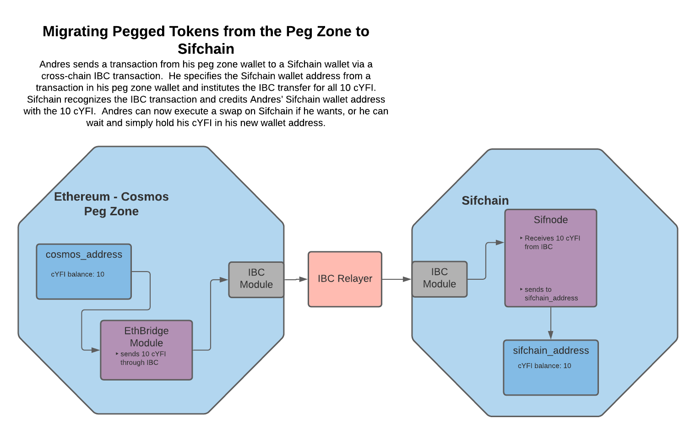
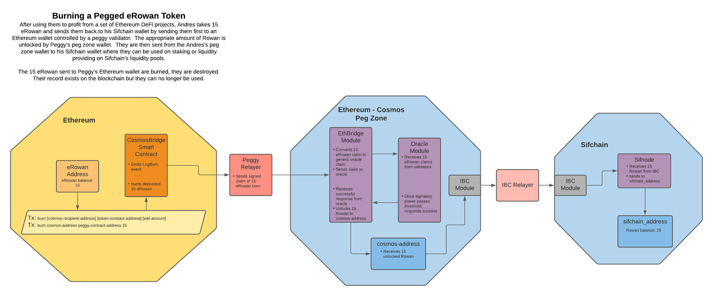

# **Ethereum Cosmos Bridge Architecture**

## Changelog
-First Sifchain Draft WIP: Austin Haines (Barefoot Coders) October 8, 2020

## Context

Peggy focuses on core features for bidirectional transfers. This document outlines Sifchain's Peggy implementation. Peggy includes functionality on the Ethereum network to lock and unlock Ethereum native tokens, as well as to burn and mint Cosmos pegged assets. On Cosmos Peggy includes functionality to lock and unlock Cosmos native tokens, as well as to burn and mint Ethereum pegged assets.


The architecture consists of 5 parts. Each part, and the logical flow of operations is described below.

## The Smart Contracts

**Cosmos - Bridge Smart Contract:** This contract is responsible for locking and unlocking Ethereum tokens as well as minting and burning pegged Cosmos assets. It also emits `LogLock` and `LogBurn` events to and receives claims from the Relayer as part of the transfer flow. The contract acts as both the entry and exit point for Peggy on the Ethereum network.

**Ethereum Oracle Contract:** This contract is responsible for validation of claims on the Ethereum network received from the Ethereum - Bridge Peg Zone. 

First, the smart contracts are deployed to an Ethereum network. A user can then send Ethereum assets to that smart contract to lock up their Ethereum or burn pegged Cosmos assets and trigger the transfer flow. 

In this prototype, the system is managed by the contract's deployer, designated internally as the relayer, a trusted third-party which can unlock funds and return them their original sender. If the contract’s balances under threat, the relayer can pause the system, temporarily preventing users from depositing additional funds.


## The Relayer

The Relayer is a service which interfaces with both blockchains, allowing validators on either end to attest that specific events on the other blockchain have occurred. Through the Relayer service, validators witness the events and submit proofs in the form of signed hashes to the Oracles, which are responsible for aggregating and tallying the Validators’ signatures and their respective signing power.

The Ethereum -> Cosmos Relayer process is as follows:

- Continually listen for a `LogLock` or `LogBurn` event
- When an event is seen, parse information associated with the Ethereum transaction
- Uses this information to build an unsigned Cosmos transaction
- Signs and send this transaction to Tendermint.

The Cosmos -> Ethereum Relayer process is as follows:

- Continually listen for a `MsgLock` or `MsgBurn` event
- When an event is seen, parse information associated with the Cosmos transaction
- Uses this information to build an unsigned Ethereum transaction
- Signs and send this transaction to Ethereum.

## The EthBridge Module

The EthBridge module is a Cosmos-SDK module that is responsible for receiving and decoding claims from the Relayer and processing the result of a successful claim. The module is also responsible for receiving and processing transactions from within the Peg Zone or from other Cosmos chains via IBC and emitting `MsgLock` and `MsgBurn` events to the Relayer.

**Ethereum -> Cosmos:**

The process is as follows:

- A transaction with a message for the EthBridge module is received
- The message is decoded and transformed into a generic, non-Ethereum specific Oracle claim
- The oracle claim is given a unique ID based on the nonce from the ethereum transaction
- The generic claim is forwarded to the Oracle module.

The EthBridge module will resume later if the claim succeeds.

**Cosmos -> Ethereum:**

The process is as follows:

- A burn or lock transaction for the EthBridge module is received
- Tokens are either burned or locked
- A `MsgBurn` or `MsgLock` event is emitted to be received by the Relayer

**IBC:** This module is also responsible for sending and receiving transactions to/from the IBC Module which facilitates communication with compatible Cosmos chains. This is how pegged tokens are transferred between the Ethereum - Cosmos Peg Zone and other Cosmos chains such as Sifchain where they can be used to swap, provide liquidity to liquidity pools, etc.

## IBC 

In order to facilitate cross chain communication amongst IBC compatible chains the Ethereum - Cosmos Peg Zone utilized an IBC Module and an IBC Relayer.

**IBC Module:**

This module receives transactions from the EthBridge Module and emits an event to be received by the IBC Relayer. It also receives incoming transactions from other IBC chains such as Sifchain and forwards them to the EthBridge Module.

**IBC Relayer:**

This relayer listens to events from the IBC Module and forwards the transactions to external Cosmos chains such as Sifchain.

## The Oracle Module

The Oracle module is intended to be a more generic oracle module that can take arbitrary claims from different validators, hold onto them and perform consensus on those claims once a certain threshold is reached. In this project it is used to find consensus on claims about activity on an Ethereum chain, but it is designed and intended to be able to be used for any other kinds of oracle-like functionality in future (eg: claims about the weather).

The process is as follows:

- A claim is received from another module (EthBridge in this case)
- That claim is checked, along with other past claims from other validators with the same unique ID
- Once a threshold of stake of the active Tendermint validator set is claiming the same thing, the claim is updated to be successful
- If a threshold of stake of the active Tendermint validator set disagrees, the claim is updated to be a failure
- The status of the claim is returned to the module that provided the claim.

## The EthBridge Module (Part 2)

The EthBridge module also contains logic for how a result should be processed.

The process is as follows:

- Once a claim has been processed by the Oracle, the status is returned
- If the claim is successful, new tokens representing Ethereum are minted via the Bank module

## Cosmos Messages and Ethereum Logs


## Architecture Diagram


## Use Case Information Flows







## Ethereum Cosmos - Bridge Smart Contract Functions

  **Locking Tokens:**
```javascript 
    /*
     * @dev: Locks received Ethereum/ERC20 funds.
     *
     * @param _recipient: bytes representation of destination address.
     * @param _token: token address in origin chain (0x0 if ethereum)
     * @param _amount: value of deposit
     */
    function lock(bytes memory _recipient, address _token, uint256 _amount)
        public
        payable
        availableNonce()
    {
        string memory symbol;

        // Ethereum deposit
        if (msg.value > 0) {
            require(
                _token == address(0),
                "Ethereum deposits require the 'token' address to be the null address"
            );
            require(
                msg.value == _amount,
                "The transactions value must be equal the specified amount (in wei)"
            );
            symbol = "ETH";
        // ERC20 deposit
        } else {
            require(
                BridgeToken(_token).transferFrom(
                    msg.sender,
                    address(this),
                    _amount
                ),
                "Contract token allowances insufficient to complete this lock request"
            );
            // Set symbol to the ERC20 token's symbol
            symbol = BridgeToken(_token).symbol();
        }

        lockFunds(msg.sender, _recipient, _token, symbol, _amount);
    }

    /*
     * @dev: Creates a new Ethereum deposit with a unique id.
     *
     * @param _sender: The sender's ethereum address.
     * @param _recipient: The intended recipient's cosmos address.
     * @param _token: The currency type, either erc20 or ethereum.
     * @param _amount: The amount of erc20 tokens/ ethereum (in wei) to be itemized.
     */
    function lockFunds(
        address payable _sender,
        bytes memory _recipient,
        address _token,
        string memory _symbol,
        uint256 _amount
    ) internal {
        lockBurnNonce = lockBurnNonce.add(1);

        // Increment locked funds by the amount of tokens to be locked
        lockedTokenList[_symbol] = _token;
        lockedFunds[_token] = lockedFunds[_token].add(_amount);

        emit LogLock(_sender, _recipient, _token, _symbol, _amount, lockBurnNonce);
    }
```
  **Burning Tokens:** 

```javascript 
    /*
     * @dev: Burns BridgeTokens representing native Cosmos assets.
     *
     * @param _recipient: bytes representation of destination address.
     * @param _token: token address in origin chain (0x0 if ethereum)
     * @param _amount: value of deposit
     */
    function burn(bytes memory _recipient, address _token, uint256 _amount)
        public
        availableNonce()
    {
        BridgeToken(_token).burnFrom(msg.sender, _amount);
        string memory symbol = BridgeToken(_token).symbol();
        burnFunds(msg.sender, _recipient, _token, symbol, _amount);
    }

    /*
     * @dev: Creates a new Ethereum deposit with a unique id.
     *
     * @param _sender: The sender's ethereum address.
     * @param _recipient: The intended recipient's cosmos address.
     * @param _token: The currency type, either erc20 or ethereum.
     * @param _amount: The amount of erc20 tokens/ ethereum (in wei) to be itemized.
     */
    function burnFunds(
        address payable _sender,
        bytes memory _recipient,
        address _token,
        string memory _symbol,
        uint256 _amount
    ) internal {
        lockBurnNonce = lockBurnNonce.add(1);
        emit LogBurn(_sender, _recipient, _token, _symbol, _amount, lockBurnNonce);
    }
```

  **Minting Pegged Cosmos Assets:**
  ```javascript
    /*
     * @dev: Mints new BankTokens
     *
     * @param _cosmosSender: The sender's Cosmos address in bytes.
     * @param _ethereumRecipient: The intended recipient's Ethereum address.
     * @param _cosmosTokenAddress: The currency type
     * @param _symbol: comsos token symbol
     * @param _amount: number of comsos tokens to be minted
     */
    function mintBridgeTokens(
        bytes memory _cosmosSender,
        address payable _intendedRecipient,
        address _bridgeTokenAddress,
        string memory _symbol,
        uint256 _amount
    ) public onlyCosmosBridge {
        return
            mintNewBridgeTokens(
                _cosmosSender,
                _intendedRecipient,
                _bridgeTokenAddress,
                _symbol,
                _amount
            );
    }
  ```

  **Unlocking Tokens:** 
  ```javascript
    /*
     * @dev: Unlocks Ethereum and ERC20 tokens held on the contract.
     *
     * @param _recipient: recipient's Ethereum address
     * @param _token: token contract address
     * @param _symbol: token symbol
     * @param _amount: wei amount or ERC20 token count
     */
    function unlock(
        address payable _recipient,
        string memory _symbol,
        uint256 _amount
    ) public onlyCosmosBridge {
        // Confirm that the bank has sufficient locked balances of this token type
        require(
            getLockedFunds(_symbol) >= _amount,
            "The Bank does not hold enough locked tokens to fulfill this request."
        );

        // Confirm that the bank holds sufficient balances to complete the unlock
        address tokenAddress = lockedTokenList[_symbol];
        if (tokenAddress == address(0)) {
            require(
                address(this).balance >= _amount,
                "Insufficient ethereum balance for delivery."
            );
        } else {
            require(
                BridgeToken(tokenAddress).balanceOf(address(this)) >= _amount,
                "Insufficient ERC20 token balance for delivery."
            );
        }
        unlockFunds(_recipient, tokenAddress, _symbol, _amount);
    }

    /*
     * @dev: Unlocks funds held on contract and sends them to the
     *       intended recipient
     *
     * @param _recipient: recipient's Ethereum address
     * @param _token: token contract address
     * @param _symbol: token symbol
     * @param _amount: wei amount or ERC20 token count
     */
    function unlockFunds(
        address payable _recipient,
        address _token,
        string memory _symbol,
        uint256 _amount
    ) internal {
        // Decrement locked funds mapping by the amount of tokens to be unlocked
        lockedFunds[_token] = lockedFunds[_token].sub(_amount);

        // Transfer funds to intended recipient
        if (_token == address(0)) {
            _recipient.transfer(_amount);
        } else {
            require(
                BridgeToken(_token).transfer(_recipient, _amount),
                "Token transfer failed"
            );
        }

        emit LogUnlock(_recipient, _token, _symbol, _amount);
    }
```
  **Processing claims:**

```javascript
    /*
     * @dev: newProphecyClaim
     *       Creates a new burn or lock prophecy claim, adding it to the prophecyClaims mapping.
     *       Burn claims require that there are enough locked Ethereum assets to complete the prophecy.
     *       Lock claims have a new token contract deployed or use an existing contract based on symbol.
     */
    function newProphecyClaim(
        ClaimType _claimType,
        bytes memory _cosmosSender,
        address payable _ethereumReceiver,
        string memory _symbol,
        uint256 _amount
    ) public isActive {
        require(
            valset.isActiveValidator(msg.sender),
            "Must be an active validator"
        );

        address tokenAddress;
        string memory symbol;
        if (_claimType == ClaimType.Burn) {
            require(
                bridgeBank.getLockedFunds(_symbol) >= _amount,
                "Not enough locked assets to complete the proposed prophecy"
            );
            symbol = _symbol;
            tokenAddress = bridgeBank.getLockedTokenAddress(_symbol);
        } else if (_claimType == ClaimType.Lock) {
            symbol = concat(COSMOS_NATIVE_ASSET_PREFIX, _symbol); // Add 'PEGGY' symbol prefix
            address bridgeTokenAddress = bridgeBank.getBridgeToken(symbol);
            if (bridgeTokenAddress == address(0)) {
                // First lock of this asset, deploy new contract and get new symbol/token address
                tokenAddress = bridgeBank.createNewBridgeToken(symbol);
            } else {
                // Not the first lock of this asset, get existing symbol/token address
                tokenAddress = bridgeTokenAddress;
            }
        } else {
            revert("Invalid claim type, only burn and lock are supported.");
        }

        // Create the new ProphecyClaim
        ProphecyClaim memory prophecyClaim = ProphecyClaim(
            _claimType,
            _cosmosSender,
            _ethereumReceiver,
            msg.sender,
            tokenAddress,
            symbol,
            _amount,
            Status.Pending
        );

        // Increment count and add the new ProphecyClaim to the mapping
        prophecyClaimCount = prophecyClaimCount.add(1);
        prophecyClaims[prophecyClaimCount] = prophecyClaim;

        emit LogNewProphecyClaim(
            prophecyClaimCount,
            _claimType,
            _cosmosSender,
            _ethereumReceiver,
            msg.sender,
            tokenAddress,
            symbol,
            _amount
        );
    }

    /*
     * @dev: completeProphecyClaim
     *       Allows for the completion of ProphecyClaims once processed by the Oracle.
     *       Burn claims unlock tokens stored by BridgeBank.
     *       Lock claims mint BridgeTokens on BridgeBank's token whitelist.
     */
    function completeProphecyClaim(uint256 _prophecyID)
        public
        isPending(_prophecyID)
    {
        require(
            msg.sender == oracle,
            "Only the Oracle may complete prophecies"
        );

        prophecyClaims[_prophecyID].status = Status.Success;

        ClaimType claimType = prophecyClaims[_prophecyID].claimType;
        if (claimType == ClaimType.Burn) {
            unlockTokens(_prophecyID);
        } else {
            issueBridgeTokens(_prophecyID);
        }

        emit LogProphecyCompleted(_prophecyID, claimType);
    }
  ```

## Ethereum Oracle Smart Contract

  **Processing Prophecy Claims:**

```javascript
    /*
     * @dev: newOracleClaim
     *       Allows validators to make new OracleClaims on an existing Prophecy
     */
    function newOracleClaim(
        uint256 _prophecyID,
        bytes32 _message,
        bytes memory _signature
    ) public onlyValidator isPending(_prophecyID) {
        address validatorAddress = msg.sender;

        // Validate the msg.sender's signature
        require(
            validatorAddress == valset.recover(_message, _signature),
            "Invalid message signature."
        );

        // Confirm that this address has not already made an oracle claim on this prophecy
        require(
            !hasMadeClaim[_prophecyID][validatorAddress],
            "Cannot make duplicate oracle claims from the same address."
        );

        hasMadeClaim[_prophecyID][validatorAddress] = true;
        oracleClaimValidators[_prophecyID].push(validatorAddress);

        emit LogNewOracleClaim(
            _prophecyID,
            _message,
            validatorAddress,
            _signature
        );

        // Process the prophecy
        (
            bool valid,
            uint256 prophecyPowerCurrent,
            uint256 prophecyPowerThreshold
        ) = getProphecyThreshold(_prophecyID);

        if (valid) {
            completeProphecy(_prophecyID);

            emit LogProphecyProcessed(
                _prophecyID,
                prophecyPowerCurrent,
                prophecyPowerThreshold,
                msg.sender
            );
        }
    }

    /*
     * @dev: processBridgeProphecy
     *       Pubically available method which attempts to process a bridge prophecy
     */
    function processBridgeProphecy(uint256 _prophecyID)
        public
        isPending(_prophecyID)
    {
        // Process the prophecy
        (
            bool valid,
            uint256 prophecyPowerCurrent,
            uint256 prophecyPowerThreshold
        ) = getProphecyThreshold(_prophecyID);

        require(
            valid,
            "The cumulative power of signatory validators does not meet the threshold"
        );

        // Update the BridgeClaim's status
        completeProphecy(_prophecyID);

        emit LogProphecyProcessed(
            _prophecyID,
            prophecyPowerCurrent,
            prophecyPowerThreshold,
            msg.sender
        );
    }

    /*
     * @dev: checkBridgeProphecy
     *       Operator accessor method which checks if a prophecy has passed
     *       the validity threshold, without actually completing the prophecy.
     */
    function checkBridgeProphecy(uint256 _prophecyID)
        public
        view
        onlyOperator
        isPending(_prophecyID)
        returns (bool, uint256, uint256)
    {
        require(
            cosmosBridge.isProphecyClaimActive(_prophecyID) == true,
            "Can only check active prophecies"
        );
        return getProphecyThreshold(_prophecyID);
    }

    /*
     * @dev: processProphecy
     *       Calculates the status of a prophecy. The claim is considered valid if the
     *       combined active signatory validator powers pass the consensus threshold.
     *       The threshold is x% of Total power, where x is the consensusThreshold param.
     */
    function getProphecyThreshold(uint256 _prophecyID)
        internal
        view
        returns (bool, uint256, uint256)
    {
        uint256 signedPower = 0;
        uint256 totalPower = valset.totalPower();

        // Iterate over the signatory addresses
        for (
            uint256 i = 0;
            i < oracleClaimValidators[_prophecyID].length;
            i = i.add(1)
        ) {
            address signer = oracleClaimValidators[_prophecyID][i];

            // Only add the power of active validators
            if (valset.isActiveValidator(signer)) {
                signedPower = signedPower.add(valset.getValidatorPower(signer));
            }
        }

        // Prophecy must reach total signed power % threshold in order to pass consensus
        uint256 prophecyPowerThreshold = totalPower.mul(consensusThreshold);
        // consensusThreshold is a decimal multiplied by 100, so signedPower must also be multiplied by 100
        uint256 prophecyPowerCurrent = signedPower.mul(100);
        bool hasReachedThreshold = prophecyPowerCurrent >=
            prophecyPowerThreshold;

        return (
            hasReachedThreshold,
            prophecyPowerCurrent,
            prophecyPowerThreshold
        );
    }

    /*
     * @dev: completeProphecy
     *       Completes a prophecy by completing the corresponding BridgeClaim
     *       on the CosmosBridge.
     */
    function completeProphecy(uint256 _prophecyID) internal {
        cosmosBridge.completeProphecyClaim(_prophecyID);
    }
}
```

## Cosmos EthBridge Module Functions

  **Locking Tokens:**

```golang
// ProcessLock processes the lockup of cosmos coins from the given sender
func (k Keeper) ProcessLock(ctx sdk.Context, cosmosSender sdk.AccAddress, amount sdk.Coins) error {
	return k.supplyKeeper.SendCoinsFromAccountToModule(ctx, cosmosSender, types.ModuleName, amount)
}
```

  **Burning Tokens:**

```golang
// ProcessBurn processes the burn of bridged coins from the given sender
func (k Keeper) ProcessBurn(ctx sdk.Context, cosmosSender sdk.AccAddress, amount sdk.Coins) error {
	if err := k.supplyKeeper.SendCoinsFromAccountToModule(
		ctx, cosmosSender, types.ModuleName, amount,
	); err != nil {
		return err
	}

	if err := k.supplyKeeper.BurnCoins(ctx, types.ModuleName, amount); err != nil {
		panic(err)
	}

	return nil
}
```

  **Processing Claims:**

  ```golang
// Handle a message to create a bridge claim
func handleMsgCreateEthBridgeClaim(
	ctx sdk.Context, cdc *codec.Codec, bridgeKeeper Keeper, msg MsgCreateEthBridgeClaim,
) (*sdk.Result, error) {
	status, err := bridgeKeeper.ProcessClaim(ctx, types.EthBridgeClaim(msg))
	if err != nil {
		return nil, err
	}
	if status.Text == oracle.SuccessStatusText {
		if err = bridgeKeeper.ProcessSuccessfulClaim(ctx, status.FinalClaim); err != nil {
			return nil, err
		}
	}

	ctx.EventManager().EmitEvents(sdk.Events{
		sdk.NewEvent(
			sdk.EventTypeMessage,
			sdk.NewAttribute(sdk.AttributeKeyModule, types.AttributeValueCategory),
			sdk.NewAttribute(sdk.AttributeKeySender, msg.ValidatorAddress.String()),
		),
		sdk.NewEvent(
			types.EventTypeCreateClaim,
			sdk.NewAttribute(types.AttributeKeyEthereumSender, msg.EthereumSender.String()),
			sdk.NewAttribute(types.AttributeKeyCosmosReceiver, msg.CosmosReceiver.String()),
			sdk.NewAttribute(types.AttributeKeyAmount, strconv.FormatInt(msg.Amount, 10)),
			sdk.NewAttribute(types.AttributeKeySymbol, msg.Symbol),
			sdk.NewAttribute(types.AttributeKeyTokenContract, msg.TokenContractAddress.String()),
			sdk.NewAttribute(types.AttributeKeyClaimType, msg.ClaimType.String()),
		),
		sdk.NewEvent(
			types.EventTypeProphecyStatus,
			sdk.NewAttribute(types.AttributeKeyStatus, status.Text.String()),
		),
	})

	return &sdk.Result{Events: ctx.EventManager().Events()}, nil
}

// ProcessSuccessfulClaim processes a claim that has just completed successfully with consensus
func (k Keeper) ProcessSuccessfulClaim(ctx sdk.Context, claim string) error {
	oracleClaim, err := types.CreateOracleClaimFromOracleString(claim)
	if err != nil {
		return err
	}

	receiverAddress := oracleClaim.CosmosReceiver

	var coins sdk.Coins
	switch oracleClaim.ClaimType {
	case types.LockText:
		symbol := fmt.Sprintf("%v%v", types.PeggedCoinPrefix, oracleClaim.Symbol)
		coins = sdk.Coins{sdk.NewInt64Coin(symbol, oracleClaim.Amount)}
		err = k.supplyKeeper.MintCoins(ctx, types.ModuleName, coins)
	case types.BurnText:
		coins = sdk.Coins{sdk.NewInt64Coin(oracleClaim.Symbol, oracleClaim.Amount)}
		err = k.supplyKeeper.MintCoins(ctx, types.ModuleName, coins)
	default:
		err = types.ErrInvalidClaimType
	}

	if err != nil {
		return err
	}

	if err := k.supplyKeeper.SendCoinsFromModuleToAccount(
		ctx, types.ModuleName, receiverAddress, coins,
	); err != nil {
		panic(err)
	}

	return nil
}
```

## Cosmos Oracle Module Functions

 **Processing Claims:**

```golang
// ProcessClaim ...
func (k Keeper) ProcessClaim(ctx sdk.Context, claim types.Claim) (types.Status, error) {
	activeValidator := k.checkActiveValidator(ctx, claim.ValidatorAddress)
	if !activeValidator {
		return types.Status{}, types.ErrInvalidValidator
	}

	if claim.ID == "" {
		return types.Status{}, types.ErrInvalidIdentifier
	}

	if claim.Content == "" {
		return types.Status{}, types.ErrInvalidClaim
	}

	prophecy, found := k.GetProphecy(ctx, claim.ID)
	if !found {
		prophecy = types.NewProphecy(claim.ID)
	}

	switch prophecy.Status.Text {
	case types.PendingStatusText:
		// continue processing
	default:
		return types.Status{}, types.ErrProphecyFinalized
	}

	if prophecy.ValidatorClaims[claim.ValidatorAddress.String()] != "" {
		return types.Status{}, types.ErrDuplicateMessage
	}

	prophecy.AddClaim(claim.ValidatorAddress, claim.Content)
	prophecy = k.processCompletion(ctx, prophecy)

	k.setProphecy(ctx, prophecy)
	return prophecy.Status, nil
}

func (k Keeper) checkActiveValidator(ctx sdk.Context, validatorAddress sdk.ValAddress) bool {
	validator, found := k.stakeKeeper.GetValidator(ctx, validatorAddress)
	if !found {
		return false
	}

	return validator.IsBonded()
}

// processCompletion looks at a given prophecy
// an assesses whether the claim with the highest power on that prophecy has enough
// power to be considered successful, or alternatively,
// will never be able to become successful due to not enough validation power being
// left to push it over the threshold required for consensus.
func (k Keeper) processCompletion(ctx sdk.Context, prophecy types.Prophecy) types.Prophecy {
	highestClaim, highestClaimPower, totalClaimsPower := prophecy.FindHighestClaim(ctx, k.stakeKeeper)
	totalPower := k.stakeKeeper.GetLastTotalPower(ctx)
	highestConsensusRatio := float64(highestClaimPower) / float64(totalPower.Int64())
	remainingPossibleClaimPower := totalPower.Int64() - totalClaimsPower
	highestPossibleClaimPower := highestClaimPower + remainingPossibleClaimPower
	highestPossibleConsensusRatio := float64(highestPossibleClaimPower) / float64(totalPower.Int64())
	if highestConsensusRatio >= k.consensusNeeded {
		prophecy.Status.Text = types.SuccessStatusText
		prophecy.Status.FinalClaim = highestClaim
	} else if highestPossibleConsensusRatio < k.consensusNeeded {
		prophecy.Status.Text = types.FailedStatusText
	}
	return prophecy
}

```

## Relayer Functions

  **Processing Cosmos Events:**

```golang
  // getOracleClaimType sets the OracleClaim's claim type based upon the witnessed event type
func getOracleClaimType(eventType string) types.Event {
	var claimType types.Event
	switch eventType {
	case types.MsgBurn.String():
		claimType = types.MsgBurn
	case types.MsgLock.String():
		claimType = types.MsgLock
	default:
		claimType = types.Unsupported
	}
	return claimType
}

// Parses event data from the msg, event, builds a new ProphecyClaim, and relays it to Ethereum
func (sub CosmosSub) handleBurnLockMsg(attributes []tmKv.Pair, claimType types.Event) error {
	cosmosMsg := txs.BurnLockEventToCosmosMsg(claimType, attributes)
	sub.Logger.Info(cosmosMsg.String())

	// TODO: Ideally one validator should relay the prophecy and other validators make oracle claims upon that prophecy
	prophecyClaim := txs.CosmosMsgToProphecyClaim(cosmosMsg)
	err := txs.RelayProphecyClaimToEthereum(sub.EthProvider, sub.RegistryContractAddress,
		claimType, prophecyClaim, sub.PrivateKey)
	if err != nil {
		return err
	}
	return nil
}
```

  **Processing Ethereum Events:**

  ```golang
func (sub EthereumSub) handleEthereumEvent(clientChainID *big.Int, contractAddress common.Address,
	contractABI abi.ABI, eventName string, cLog ctypes.Log) error {
	// Parse the event's attributes via contract ABI
	event := types.EthereumEvent{}
	err := contractABI.Unpack(&event, eventName, cLog.Data)
	if err != nil {
		sub.Logger.Error("error unpacking: %v", err)
	}
	event.BridgeContractAddress = contractAddress
	event.EthereumChainID = clientChainID
	if eventName == types.LogBurn.String() {
		event.ClaimType = ethbridge.BurnText
	} else {
		event.ClaimType = ethbridge.LockText
	}
	sub.Logger.Info(event.String())

	// Add the event to the record
	types.NewEventWrite(cLog.TxHash.Hex(), event)

	prophecyClaim, err := txs.EthereumEventToEthBridgeClaim(sub.ValidatorAddress, &event)
	if err != nil {
		return err
	}
	return txs.RelayToCosmos(sub.Cdc, sub.ValidatorName, &prophecyClaim, sub.CliCtx, sub.TxBldr)
}

// Unpacks a handleLogNewProphecyClaim event, builds a new OracleClaim, and relays it to Ethereum
func (sub EthereumSub) handleLogNewProphecyClaim(contractAddress common.Address, contractABI abi.ABI,
	eventName string, cLog ctypes.Log) error {
	// Parse the event's attributes via contract ABI
	event := types.ProphecyClaimEvent{}
	err := contractABI.Unpack(&event, eventName, cLog.Data)
	if err != nil {
		sub.Logger.Error("error unpacking: %v", err)
	}
	sub.Logger.Info(event.String())

	oracleClaim, err := txs.ProphecyClaimToSignedOracleClaim(event, sub.PrivateKey)
	if err != nil {
		return err
	}
	return txs.RelayOracleClaimToEthereum(sub.EthProvider, contractAddress, types.LogNewProphecyClaim,
		oracleClaim, sub.PrivateKey)
}
```

## IBC Module Integration

  **app.go:**

```golang
// BasicManager and ModuleAccount permissions
var (

  ModuleBasics = module.NewBasicManager(
    // ...
    capability.AppModuleBasic{},
    ibc.AppModuleBasic{},
    evidence.AppModuleBasic{},
    transfer.AppModuleBasic{}, // i.e ibc-transfer module
  )

  // module account permissions
  maccPerms = map[string][]string{
    // other module accounts permissions
    // ...
    ibctransfertypes.ModuleName:    {authtypes.Minter, authtypes.Burner},
)

// Keepers
type App struct {
  // baseapp, keys and subspaces definitions

  // other keepers
  // ...
  IBCKeeper        *ibckeeper.Keeper // IBC Keeper must be a pointer in the app, so we can SetRouter on it correctly
  EvidenceKeeper   evidencekeeper.Keeper // required to set up the client misbehaviour route
  TransferKeeper   ibctransferkeeper.Keeper // for cross-chain fungible token transfers

  // make scoped keepers public for test purposes
  ScopedIBCKeeper      capabilitykeeper.ScopedKeeper
  ScopedTransferKeeper capabilitykeeper.ScopedKeeper

  /// ...
  /// module and simulation manager definitions
}

// Configure the Keepers
// Register Routers
// Add Modules to Module Manager
func NewApp(...args) *App {
  // .. continuation from above

  // Create static IBC router, add ibc-tranfer module route, then set and seal it
  ibcRouter := port.NewRouter()
  ibcRouter.AddRoute(ibctransfertypes.ModuleName, transferModule)
  // Setting Router will finalize all routes by sealing router
  // No more routes can be added
  app.IBCKeeper.SetRouter(ibcRouter)

  // create static Evidence routers

  evidenceRouter := evidencetypes.NewRouter().
    // add IBC ClientMisbehaviour evidence handler
    AddRoute(ibcclient.RouterKey, ibcclient.HandlerClientMisbehaviour(app.IBCKeeper.ClientKeeper))

  // Setting Router will finalize all routes by sealing router
  // No more routes can be added
  evidenceKeeper.SetRouter(evidenceRouter)

  // set the evidence keeper from the section above
  app.EvidenceKeeper = *evidenceKeeper

  app.mm = module.NewManager(
    // other modules
    // ...
    capability.NewAppModule(appCodec, *app.CapabilityKeeper),
    evidence.NewAppModule(app.EvidenceKeeper),
    ibc.NewAppModule(app.IBCKeeper),
    transferModule,
  )

  // ...

  // NOTE: Capability module must occur first so that it can initialize any capabilities
  // so that other modules that want to create or claim capabilities afterwards in InitChain
  // can do so safely.
  app.mm.SetOrderInitGenesis(
    capabilitytypes.ModuleName,
    // other modules ...
    ibchost.ModuleName, evidencetypes.ModuleName, ibctransfertypes.ModuleName,
  )

  // .. continues
```

**module.go**

```golang
func NewAppModule(...args) *App {
  // define codecs and baseapp

  // add capability keeper and ScopeToModule for ibc module
  app.CapabilityKeeper = capabilitykeeper.NewKeeper(appCodec, keys[capabilitytypes.StoreKey], memKeys[capabilitytypes.MemStoreKey])

  // grant capabilities for the ibc and ibc-transfer modules
  scopedIBCKeeper := app.CapabilityKeeper.ScopeToModule(ibchost.ModuleName)
  scopedTransferKeeper := app.CapabilityKeeper.ScopeToModule(ibctransfertypes.ModuleName)

  // ... other modules keepers

  // Create IBC Keeper
  app.IBCKeeper = ibckeeper.NewKeeper(
  appCodec, keys[ibchost.StoreKey], app.StakingKeeper, scopedIBCKeeper,
  )

  // Create Transfer Keepers
  app.TransferKeeper = ibctransferkeeper.NewKeeper(
    appCodec, keys[ibctransfertypes.StoreKey],
    app.IBCKeeper.ChannelKeeper, &app.IBCKeeper.PortKeeper,
    app.AccountKeeper, app.BankKeeper, scopedTransferKeeper,
  )
  transferModule := transfer.NewAppModule(app.TransferKeeper)

  // Create evidence Keeper for to register the IBC light client misbehaviour evidence route
  evidenceKeeper := evidencekeeper.NewKeeper(
    appCodec, keys[evidencetypes.StoreKey], &app.StakingKeeper, app.SlashingKeeper,
  )

  // .. continues
}
```