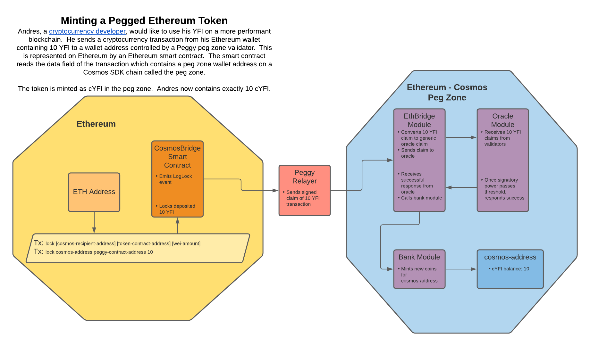

# **Ethereum Cosmos Bridge Architecture**

## Changelog
-First Sifchain Draft WIP: Austin Haines (Barefoot Coders) October 8, 2020

## Context

Peggy focuses on core features for bidirectional transfers. This document outlines Sifchain's Peggy implementation. Peggy includes functionality on the Ethereum network to lock and unlock Ethereum native tokens, as well as to burn and mint Cosmos pegged assets. On Cosmos Peggy includes functionality to lock and unlock Cosmos native tokens, as well as to burn and mint Ethereum pegged assets.

The architecture consists of 4 parts. Each part, and the logical flow of operations is described below.

## The Smart Contracts

**Cosmos - Bridge Smart Contract:** This contract is responsible for locking and unlocking Ethereum tokens as well as minting and burning pegged Cosmos assets. It also emits `LogLock` and `LogBurn` events to and receives claims from the Relayer as part of the transfer flow. The contract acts as both the entry and exit point for Peggy on the Ethereum network.

**Ethereum Oracle Contract:** This contract is responsible for validation of claims on the Ethereum network received from the Ethereum - Bridge Peg Zone. 

First, the smart contracts are deployed to an Ethereum network. A user can then send Ethereum assets to that smart contract to lock up their Ethereum or burn pegged Cosmos assets and trigger the transfer flow. 

In this prototype, the system is managed by the contract's deployer, designated internally as the relayer, a trusted third-party which can unlock funds and return them their original sender. If the contract’s balances under threat, the relayer can pause the system, temporarily preventing users from depositing additional funds.

## The Relayer

The Relayer is a service which interfaces with both blockchains, allowing validators on either end to attest that specific events on the other blockchain have occurred. Through the Relayer service, validators witness the events and submit proofs in the form of signed hashes to the Oracles, which are responsible for aggregating and tallying the Validators’ signatures and their respective signing power.

The Ethereum -> Cosmos Relayer process is as follows:

- continually listen for a `LogLock` or `LogBurn` event
- when an event is seen, parse information associated with the Ethereum transaction
- uses this information to build an unsigned Cosmos transaction
- signs and send this transaction to Tendermint.

The Cosmos -> Ethereum Relayer process is as follows:

- continually listen for a `MsgLock` or `MsgBurn` event
- when an event is seen, parse information associated with the Cosmos transaction
- uses this information to build an unsigned Ethereum transaction
- signs and send this transaction to Ethereum.

## The EthBridge Module

The EthBridge module is a Cosmos-SDK module that is responsible for receiving and decoding claims from the Relayer and processing the result of a successful claim. The module is also responsible for receiving and processing transactions from within the Peg Zone or from other Cosmos chains via IBC and emitting `MsgLock` and `MsgBurn` events to the Relayer.

**Ethereum -> Cosmos:**

The process is as follows:

- A transaction with a message for the EthBridge module is received
- The message is decoded and transformed into a generic, non-Ethereum specific Oracle claim
- The oracle claim is given a unique ID based on the nonce from the ethereum transaction
- The generic claim is forwarded to the Oracle module.

The EthBridge module will resume later if the claim succeeds.

**Cosmos -> Ethereum:**

The process is as follows:

- A burn or lock transaction for the EthBridge module is received
- Tokens are either burned or locked
- A `MsgBurn` or `MsgLock` event is emitted to be received by the Relayer

**IBC:** This module is also responsible for sending and receiving IBC transactions to compatible Cosmos chains. This is how pegged tokens are transferred between the Ethereum - Cosmos Peg Zone and other Cosmos chains such as Sifchain where they can be used to swap, provide liquidity to liquidity pools, etc.

## The Oracle Module

The Oracle module is intended to be a more generic oracle module that can take arbitrary claims from different validators, hold onto them and perform consensus on those claims once a certain threshold is reached. In this project it is used to find consensus on claims about activity on an Ethereum chain, but it is designed and intended to be able to be used for any other kinds of oracle-like functionality in future (eg: claims about the weather).

The process is as follows:

- A claim is received from another module (EthBridge in this case)
- That claim is checked, along with other past claims from other validators with the same unique ID
- Once a threshold of stake of the active Tendermint validator set is claiming the same thing, the claim is updated to be successful
- If a threshold of stake of the active Tendermint validator set disagrees, the claim is updated to be a failure
- The status of the claim is returned to the module that provided the claim.

## The EthBridge Module (Part 2)

The EthBridge module also contains logic for how a result should be processed.

The process is as follows:

- Once a claim has been processed by the Oracle, the status is returned
- If the claim is successful, new tokens representing Ethereum are minted via the Bank module

## Cosmos Messages and Ethereum Logs

## Architecture Diagram

## Use Case Information Flows

